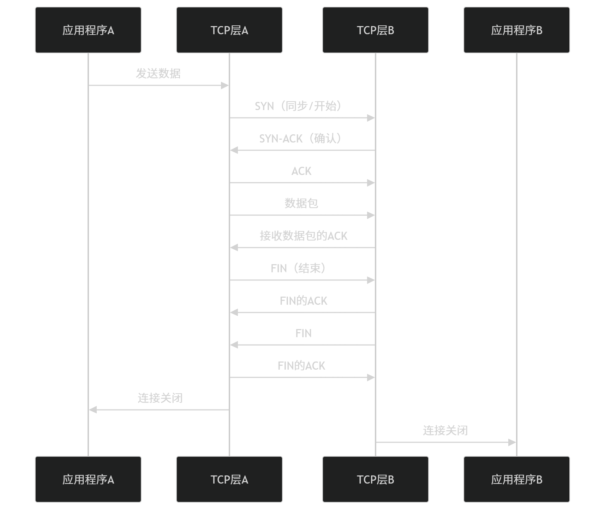

# network program

socket(套接字)是系统之间通信链路的一个逻辑端口。您的应用程序发送
并通过套接字接收其所有网络数据。有几种不同的套接字应用程序编程接口 (API)。第一个是
Berkeley socket，于 1983 年随 4.3BSD Unix 一起发布。伯克利套接字 API获得了广泛的成功并迅速发展成为事实上的标准。从那里开始，就是几乎没有修改就被采纳为 POSIX 标准。

Berkeley socket、BSD socket、Unix socket和可移植操作系统接口 (POSIX) socket通常
可以互换使用。如果您使用的是 Linux 或 macOS，那么您的操作系统提供了正确的
伯克利socket的实现。

Windows 的套接字 API 称为 Winsock。它的创建是为了在很大程度上兼容
伯克利插座。在本书中，我们努力创建对两者都有效的跨平台代码 Berkeley 套接字和 Winsock。

socket用于进程间通信（IPC）以及各种网络协议。

## sockets

套接字有两种基本类型：**面向连接**的和**无连接**的。当然，通过网络进行通信的两个系统在某种意义上是相连的。目前使用的两种协议是传输控制协议 (TCP) 和用户协议数据报协议（UDP）。 TCP是面向连接的协议，UDP是面向连接的协议
无连接协议。
### Transmission Control Protocol(TCP)

如果您需要可靠的通信，您可能会想制定一个计划，在该计划中
对发送的每个数据包进行编号。对于发送的第一个数据包，将其编号为一个，第二个
发送的数据包编号为二，依此类推。您还可以要求接收者发送
每个数据包的确认。当接收方收到第一个数据包时，它会发送一个返回
消息，收到的数据包一。这样，接收方就可以确定收到的数据包
顺序正确。如果同一个数据包到达两次，接收方可以忽略该数据包
冗余副本。如果根本没有收到数据包，发送者可以从丢失的数据包中得知
确认并可以重新发送。
该方案本质上是面向连接的协议（例如 TCP）所做的事情。传输控制协议
保证数据按照发送的顺序到达。它可以防止重复数据
到达两次，并重试发送丢失的数据。它还提供附加功能，例如
作为连接终止时的通知和缓解网络压力的算法
拥塞。此外，TCP 以无与伦比的效率实现这些功能。
可以通过在 UDP 之上搭载自定义可靠性方案来实现。
由于这些原因，许多协议都使用 TCP。 HTTP（用于断开网页）、FTP（用于
传输文件）、SSH（用于远程管理）和 SMTP（用于发送电子邮件）均使用
TCP。


### UserDatagram Protocol (UDP)

在无连接协议（例如 UDP）中，每个数据包都是单独寻址的。
从协议的角度来看，每个数据包都是完全独立、互不相关的
到它之前或之后的任何数据包。
UDP 的一个很好的类比是明信片。当您寄明信片时，不能保证
它会到达。也无法知道它是否确实到达。如果您寄了很多明信片
一旦出现，就无法预测它们将以什么顺序到达。完全有可能
您发送的第一张明信片会延迟，并在最后一张明信片发送几周后才送达。
对于 UDP，这些相同的警告也适用。 UDP 不保证数据包一定会到达。
UDP 通常不提供了解数据包是否未到达的方法，但 UDP 提供
不保证数据包将按照发送的顺序到达。如你看到的，
UDP 并不比明信片更可靠。事实上，你可能会认为它不太可靠，因为
使用 UDP，单个数据包可能会到达两次！

### socket functions

以下是 socket 相关的函数.

- socket() 创建和初始化一个套接字。
- bind() 将套接字与特定的本地 IP 地址和端口号相关联。
- listen() 在服务器上使用来使 TCP 套接字侦听新的连接。一般在服务端程序使用。
- connect() 用于客户端设置远程地址和端口。如果是TCP，它也建立连接。一般在客户端程序使用。
- accept()在服务器上用于为传入的 TCP 创建新套接字连接。
- send() and  recv() 用于通过tcp socket发送和接收数据。
- sendto() and  recvfrom()用于从没有绑定的远程地址udp socket发送和接收数据。.
- close() (Berkeley sockets) and  closesocket() (Winsock sockets) 用于关闭一个套接字。对于 TCP，这也会终止连接。
- shutdown() 用于关闭 TCP 连接的一侧。它有助于确保有序的连接拆除。
- select() 用于等待一个或多个套接字上的事件。
- getnameinfo() and  getaddrinfo() 提供独立于协议的方式使用主机名和地址。
- setsockopt()用于设置一些套接字选项。
- fcntl() (Berkeley sockets) and  ioctlsocket() (Winsock sockets) 也被使用获取和设置一些套接字选项


### raw_sockets

## tcp server client demo

tcp通信过程如图所示:



这是一个在linux和windows下都可以使用 gcc 编译 tcp 服务端和客户端示例.
主要演示建立连接，客户端和服务端通信，关闭连接的过程.

编译服务端并运行:

```bash
# 编译服务端
gcc  -o server.exe  simple_server.c  -lWs2_32  # windows
gcc  -o server.exe  simple_server.c            # linux
# 运行服务端
$ ./server.exe

```


编译客户端并运行:

```bash
# 编译客户端
gcc  -o client.exe  simple_client.c  -lWs2_32  # windows
gcc  -o client.exe  simple_client.c            # linux
# 运行客户端
$ ./client.exe  

```

### simple_server.c 源码

此代码可以在理解后补充注释.


```
{{#include ../../langsrc/c/tcpip/tcp_demo/simple_server.c}}
```

### simple_client.c 源码


```
{{#include ../../langsrc/c/tcpip/tcp_demo/simple_client.c}}
```


### 资料

[**TCP Operational Overview and the TCP Finite State Machine (FSM)**](http://www.tcpipguide.com/free/t_TCPOperationalOverviewandtheTCPFiniteStateMachineF-2.htm)  
[tcpipguide](http://www.tcpipguide.com/index.htm)


